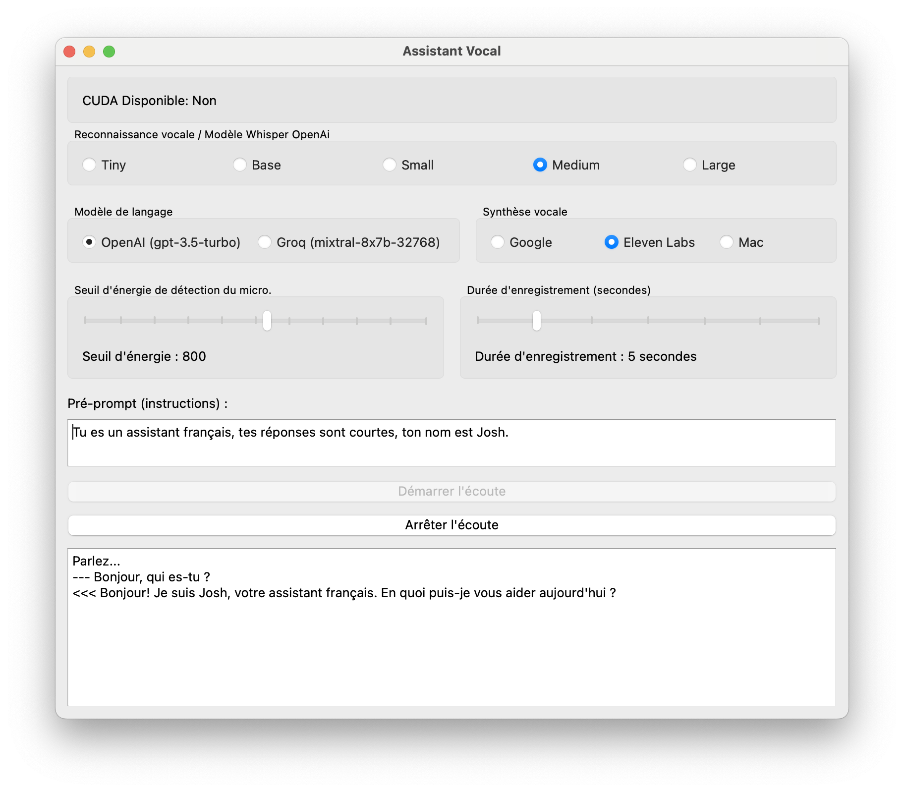

# voice_chat
## A simple voice chat with OpenAi Whisper, Google TTS, ElevenLabs

Developed by Eric Marchand, this script is a gift to the AI enthusiasts' community. The voice_chat project embodies a straightforward yet powerful implementation of modern AI technologies for voice interactions. Utilizing OpenAi's Whisper for voice recognition, Google's Text-to-Speech (TTS) for voice output, and ElevenLabs for an alternative TTS option, it offers a seamless experience for users to engage in voice chat.

You can use it without any subscription with Groq and gTTS (Google Text To Speech) or the better is OpenAI (GPT3.5 turbo feel free to change the model, subscribe and feed the OPENAI_API_KEY) with ElevenLabs (free plan give u 60000 characters/month).

### Features
- **Voice Recognition with Whisper**: Leverage the cutting-edge Whisper model for accurate speech-to-text conversion.
- **Text-to-Speech with Google TTS and ElevenLabs**: Choose between Google's reliable TTS service or the dynamic voice synthesis provided by ElevenLabs for your text-to-speech needs.
- **Simple and Intuitive GUI**: A user-friendly interface that simplifies interaction, making it accessible for users of all technical levels.
- **Real-Time Interaction**: Experience real-time voice to text and text to voice conversion, allowing for a smooth conversation flow.
- **Open Source**: Shared with the AI and programming community for free, encouraging development, learning, and collaboration.
  

### Getting Started
To run this script on your local machine, follow these steps:

1. Clone this repository:
git clone [https://github.com/stakepoolplace/voice_chat/](https://github.com/stakepoolplace/voice_chat.git)

2. Navigate to the project directory:
cd voice_chat

3. Install the required dependencies:
pip install -r requirements.txt

4. Run the script:
python voice_chat.py

### Usage
Upon launching the application, you'll be greeted with a simple and intuitive graphical interface. From there, you can:
- Start voice chat by clicking the "Start Listening" button.
- Stop the voice chat at any time with the "Stop Listening" button.
- Adjust settings such as the choice between Google TTS and ElevenLabs, and Whisper model configurations according to your preferences.

### TODO
Separating the GUI part and the data processing into two separate files in Python. Here's how:

**GUI File (`gui.py`):** Contains the class for the user interface, using PyQt5 or any other GUI framework. You define the window, widgets, and layout here.

**Processing File (`processing.py`):** Contains the processing logic, such as voice recognition and speech synthesis. You define functions or classes that perform data processing here.

To link them, you can:

- **Import the processing file into the GUI file:** Use `from processing import MyProcessingClass` to access your processing functions from your user interface.
- **Use signals and slots (in the case of PyQt5):** to connect user interface events (like a button click) to data processing actions. You trigger a processing action which, once completed, can update the user interface via a signal.

### Contributing
Contributions to the voice_chat project are welcome! Whether it's through submitting bug reports, suggesting enhancements, or adding new features, your input is valuable. Please feel free to fork the repository and submit pull requests.

### License
This project is open-source and available under the [MIT License](LICENSE).

### Acknowledgments
A heartfelt thanks to the creators of OpenAi Whisper, Google TTS, and ElevenLabs for making their technologies accessible, enabling projects like this to come to fruition.

---

Eric Marchand's dedication to sharing this project highlights the spirit of collaboration and innovation in the AI community. Enjoy exploring voice_chat, and let it inspire your next project!
